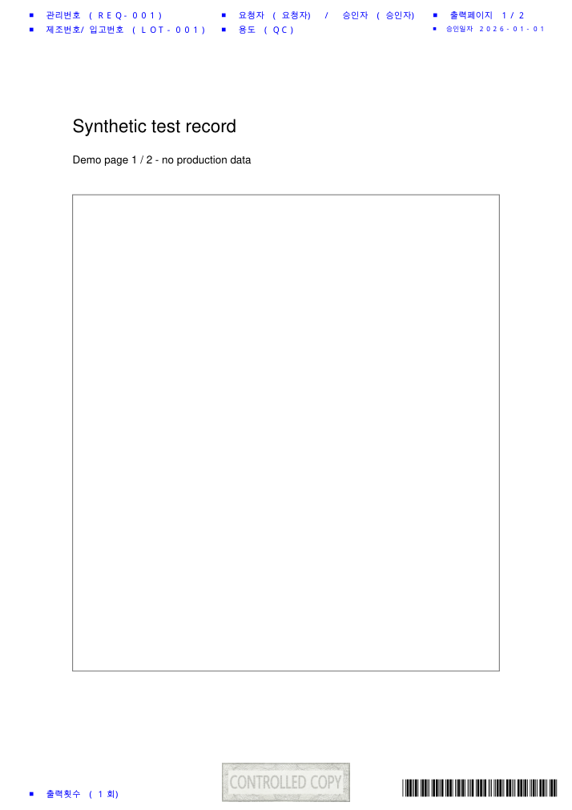

# Regulated Document Builder Demo

기존 PDF 양식에 관리번호, 요청자·승인자, 출력 정보, 바코드와 워터마크를 넣는 Python 문서 처리 데모입니다. 같은 양식을 여러 요청에 맞춰 반복 출력하는 흐름을 코드와 설정 파일로 나눴습니다.

공개 저장소에서 확인할 수 있는 범위는 PDF 합성, JSON 일괄 처리, 레이아웃 편집기, 선택적 외부 연동 코드입니다. 실제 업무 문서나 운영 접속 정보는 포함하지 않으며, 아래 예제도 직접 생성한 가상 문서만 사용합니다. 규제 준수나 운영 환경 검증을 보증하는 제품은 아닙니다.

## 구현한 흐름

- 기존 페이지를 위아래 여백 안에 축소 배치하고, 머리글·바닥글을 합성합니다.
- 관리번호와 일련번호를 Code 39 폰트로 표시하고, 투명도를 적용한 워터마크 이미지를 넣습니다.
- 전체 페이지 또는 지정한 페이지 구간을 출력합니다.
- JSON 작업 목록을 원본 PDF 경로별로 묶어 복사·전처리를 한 번만 수행하고, 요청별 결과물을 만듭니다.
- 개별 요청이 실패하면 로그를 남기고 다음 요청을 계속 처리합니다.
- 좌표, 글꼴, 색상, 문구는 `layout_config.json`에서 바꿀 수 있습니다. PyQt6 편집기에서는 배치 상자를 이동하거나 크기를 조정할 수 있습니다.

## 구조

```text
CLI / JSON
  → 원본 경로별 그룹화
  → 로컬 작업 폴더로 복사
  → 선택적 SSH 기반 파일 전처리
  → PyMuPDF로 문서 합성
  → 완료 폴더로 복사
  → 선택적 SQL Server 경로 업데이트
```

| 파일 | 역할 |
| --- | --- |
| `main.py` | 입력 검증, 그룹별 실행, 결과 저장, 선택적 DB 업데이트 |
| `document_builder.py` | 페이지 구성, 텍스트·바코드·이미지 렌더링 |
| `config.py` | 환경 변수와 레이아웃 설정 모델 |
| `storage_handler.py` | 파일시스템 복사 |
| `secure_file_handler.py`, `ssh_handler.py` | 외부 전처리 연동 |
| `gui_editor.py` | PDF 배치 편집기 |

소스는 `src/test_record_builder/`에 있습니다. 파일 복사와 외부 연동을 렌더링에서 분리해, DB나 SSH 서버 없이도 문서 합성 경로를 실행할 수 있습니다.

## 빠른 실행

Python 3.12 이상과 [uv](https://docs.astral.sh/uv/)가 필요합니다. 아래 명령은 저장소 루트에서 실행합니다.

```bash
uv sync --locked --dev
uv run python samples/create_input.py
uv run run.py --json samples/jobs.json
```

첫 명령으로 의존성을 설치하고, 두 번째 명령으로 가상의 2페이지 PDF를 만듭니다. 마지막 명령의 결과는 `output/completed/`에 저장됩니다. `samples/jobs.json`에는 실제 개인정보가 없는 예제 한 건이 들어 있습니다.



위 이미지는 예제 명령으로 만든 실제 출력의 첫 페이지입니다. 스캐너를 통한 바코드 판독 검증은 포함하지 않습니다.

단일 요청도 실행할 수 있습니다. 위치 인자가 많으므로 반복 작업에는 JSON을 권장합니다.

```bash
uv run run.py "samples/input.pdf" "REQ-001" "BARCODE-001" "0" "LOT-001" "Requester" "Approver" "QC" "2026-01-01" "1" "" "Y" "0" "0"
```

페이지 구간을 지정하려면 JSON에서 `PageReqALLYn`을 `"N"`으로, `PageReqStartNo`와 `PageReqEndNo`를 1부터 시작하는 페이지 번호로 설정합니다. 예를 들어 `"2"`, `"2"`는 원본의 두 번째 페이지만 출력합니다.

GUI 편집기는 데스크톱 환경에서 실행합니다.

```bash
uv run python src/test_record_builder/gui_editor.py
```

## 설정과 글꼴

DB 업데이트와 외부 파일 전처리는 기본적으로 꺼져 있습니다. 로컬 데모를 실행할 때는 접속 정보가 필요하지 않습니다.

| 환경 변수 | 용도 |
| --- | --- |
| `ASSET_FONT_MALGUN`, `ASSET_FONT_MALGUN_BOLD` | 일반·굵은 글꼴 경로. 지정하면 JSON의 텍스트 글꼴 경로보다 우선 |
| `ASSET_FONT_BARCODE` | 바코드 글꼴 경로 |
| `WATERMARK_IMAGE_PATH` | 워터마크 이미지 경로 |
| `STORAGE_COMPLETED_PATH` | 완료 폴더. 기본값 `output/completed` |
| `DB_UPDATE_ENABLED` | `true`일 때 SQL Server 업데이트 활성화 |
| `SECURE_FILE_ENABLED` | `true`일 때 SSH 기반 전처리 활성화 |
| `CLEANUP_RETENTION_DAYS` | 출력 파일 정리 기준 기간. 기본값 7일 |

맑은 고딕은 저장소에 포함하지 않습니다. 해당 글꼴이 없으면 PyMuPDF의 한글 지원 내장 글꼴로 대체합니다. 대체 글꼴은 자간과 굵기가 달라질 수 있으므로 실제 양식에 적용할 때는 출력 결과를 확인해야 합니다.

외부 연동을 사용하려면 별도 환경에서 `DB_SERVER`, `DB_NAME`, `DB_USER`, `DB_PASSWORD`, `DB_DRIVER` 또는 `SSH_HOSTNAME`, `SSH_USERNAME` 등의 설정이 필요합니다. SQL Server 연동에는 해당 시스템의 ODBC 드라이버도 필요합니다. 비밀 값은 Git에 올리지 마세요. 현재 코드는 `.env`를 환경 변수보다 우선해 읽으므로 실행 환경과 파일 설정이 충돌하지 않도록 주의해야 합니다.

## 테스트

```bash
uv run pytest -q
```

설정의 JSON 왕복 변환, DB 업데이트 분기, 문서 객체의 오류 처리와 함께 다음 재현 경로를 검사합니다.

- 글꼴 파일이 없을 때 한글 텍스트 보존
- 환경 변수로 지정한 글꼴과 JSON 설정의 우선순위
- 가상 PDF와 JSON 입력을 이용한 페이지 선택·한글·승인일자·바코드 폰트·워터마크 출력
- 현재 디렉터리에 결과 PDF 저장

실제 DB·SSH 서버 연결, GUI 상호작용, 바코드 스캔은 자동 테스트 범위 밖입니다.

## 사용 전 확인할 점

- 실행할 때마다 `output/temp_downloads`, `output/temp_secure_file`을 비우며, `output/` 아래의 오래된 파일도 정리합니다. 중요한 파일을 이 폴더에 보관하지 마세요. 기간 판정에는 OS별 의미가 다른 `ctime`을 사용합니다.
- 결과 이름은 요청 번호·일련번호·초 단위 시각을 사용합니다. 동일 요청을 동시에 실행하는 경우의 충돌 방지는 보장하지 않습니다.
- 일부 요청만 실패했을 때는 종료 코드가 0일 수 있습니다. 성공·실패 건수는 실행 로그에서 확인해야 합니다.
- 레이아웃은 A4 세로 예제 기준입니다. 긴 문구, 다른 용지 크기, 텍스트 상자 넘침은 결과 PDF를 직접 확인해야 합니다.
- 외부 전처리·DB 코드는 연동 지점의 예제입니다. 전자서명, 감사 추적, 접근 통제, 규제 검증까지 구현한 시스템은 아닙니다.
